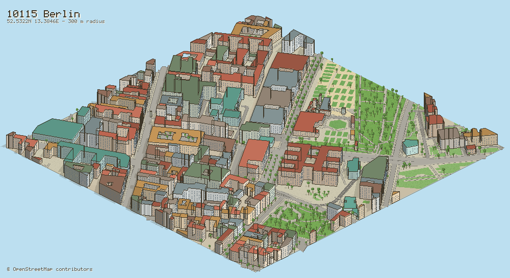
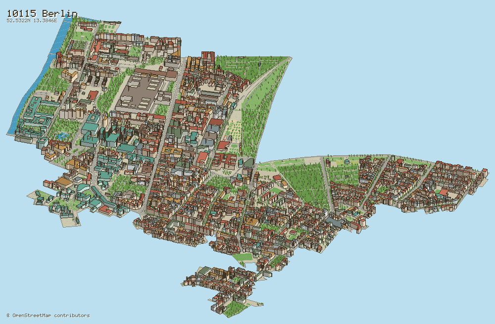
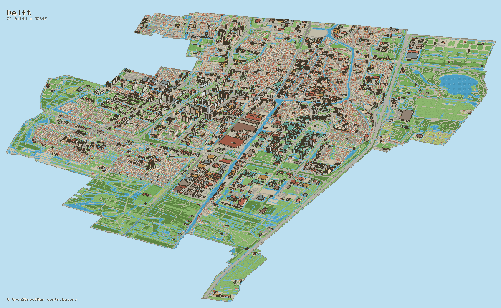
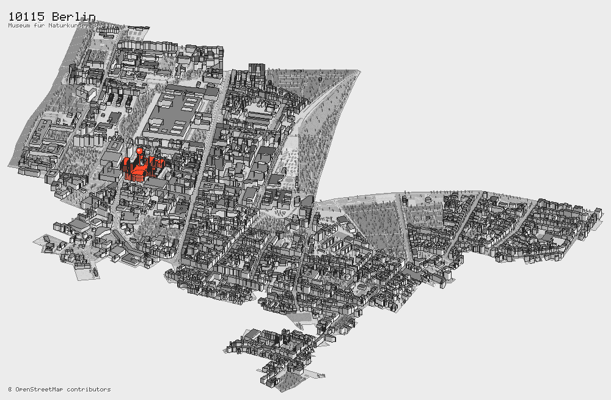
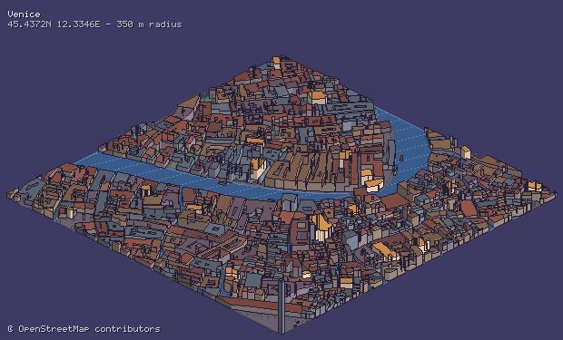
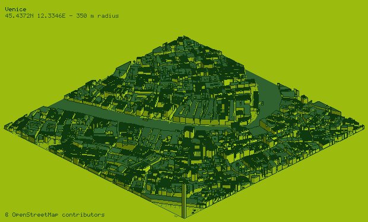
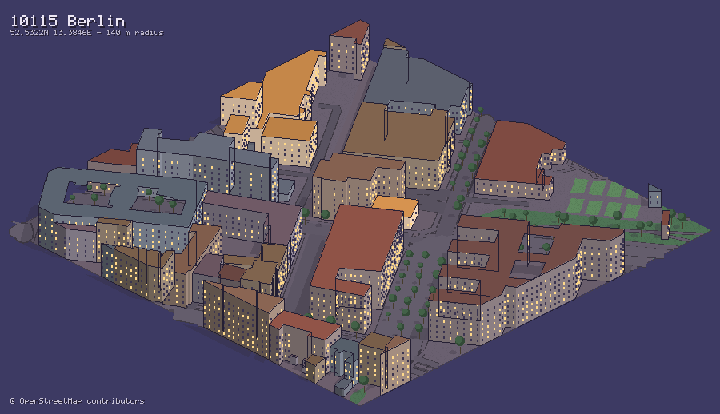

# iso-cities

Turn any city or postal code into an isometric pixel-art city, rendered from real OpenStreetMap data.

```bash
npx iso-cities "Kreuzberg, Berlin"
npx iso-cities --postcode 10115 --country DE --theme dusk
```



Give it a place. It geocodes the query, pulls the buildings, roads, water and green space around that point, extrudes every footprint to its real height, and rasterises the result as hard-edged pixel art.

There are **no runtime dependencies**. The polygon rasteriser, the PNG encoder and the bitmap font are all part of the package, so there is nothing to compile and no native canvas binding to fight with.

---

## Contents

- [Install](#install)
- [Usage](#usage)
- [Whole regions instead of a square](#whole-regions-instead-of-a-square)
- [Highlighting an address](#highlighting-an-address)
- [Themes](#themes)
- [Choosing a radius](#choosing-a-radius)
- [Library API](#library-api)
- [How it works](#how-it-works)
- [Attribution and fair use](#attribution-and-fair-use)
- [Contributing](#contributing)

---

## Install

```bash
npm install -g iso-cities   # or use npx, no install needed
```

Requires Node.js 20.11 or newer.

## Usage

```bash
# Free-form search
iso-cities "Porto"
iso-cities "Kreuzberg, Berlin"

# Postal code — always pair it with a country, codes are not unique worldwide
iso-cities --postcode 10115 --country DE
iso-cities --postcode 75001 --country FR

# Exact coordinates, skipping the geocoder entirely
iso-cities --lat 45.4408 --lon 12.3155 --name "Venice"

# Zoom in for chunkier pixels, then upscale 4x for a crisp poster
iso-cities "Porto" --radius 200 --scale 4 -o porto.png

# The real shape of a postcode district, not a square
iso-cities --postcode 10115 --country DE --region

# ...with one address picked out and everything else in grey
iso-cities --postcode 10115 --country DE --region \
           --highlight "Museum für Naturkunde, Berlin"
```

Run `iso-cities --help` for the full flag list. The most useful ones:

| Flag | Default | What it does |
| --- | --- | --- |
| `-r, --radius <m>` | `400` | Half-width of the square to draw, in metres |
| `-w, --width <px>` | `1024` | Native pixel width, before upscaling |
| `-s, --scale <n>` | `2` | Nearest-neighbour upscale factor |
| `-t, --theme <name>` | `daylight` | See [themes](#themes) |
| `--exaggeration <n>` | `1.35` | Vertical height multiplier |
| `--seed <n>` | `0` | Changes roof colours and tree placement |
| `-o, --out <file>` | derived | Output path |
| `--json <file>` | — | Also dump the parsed scene as JSON |

Layers can be switched off individually: `--no-buildings`, `--no-roads`, `--no-water`, `--no-greenery`, `--no-trees`, `--no-rails`. Styling has `--no-shadows`, `--no-windows`, `--no-outlines`, `--no-title`.

## Whole regions instead of a square

`--region` drops the square entirely and draws the place's actual outline — a postcode district, a city boundary, a borough. The geocoder returns the matched object's own geometry, and that shape becomes the ground plane.

```bash
iso-cities --postcode 10115 --country DE --region
iso-cities "Delft, Netherlands" --region --no-trees
```



Everything lying flat on the ground — roads, water, parks, shadows — is cut to the boundary exactly, by rasterising it once into a coverage mask rather than clipping thousands of polygons against a 2000-vertex concave shape. Buildings and trees stand up out of the ground plane, so they are filtered by containment instead and their roofs are free to rise above the silhouette.

If the geocoder has no outline for the match — a street address, a bare coordinate — the render falls back to `--radius` and says so.

**Regions get big.** A postcode district is a couple of square kilometres and renders in seconds. A whole municipality is a different order of magnitude:

| Query | Area | Elements | Buildings |
| --- | --- | --- | --- |
| `--postcode 10115 --country DE` | 2.4 km² | 17k | 1.9k |
| `"Delft, Netherlands"` | 24 km² | 95k | 36k |

Both work. Above 25 km² you get a warning, and `--no-trees` is worth passing; past a hundred or so the public Overpass API becomes the bottleneck long before the renderer does.

At municipal scale individual buildings fall below a pixel, so outlines are dropped automatically and the render becomes a tonal map of the built fabric — which is its own kind of useful:



## Highlighting an address

`--highlight` singles out one address: the city around it drains to grey, the matching building is painted in an accent colour, and a pin is dropped on it.

```bash
iso-cities --postcode 10115 --country DE --region \
           --highlight "Museum für Naturkunde, Berlin"

# Or an exact point, and a different accent
iso-cities "Porto" --highlight-lat 41.1408 --highlight-lon -8.6120 \
           --highlight-color '#00d4ff'
```



The address is geocoded, then matched to the building whose footprint contains it. Address nodes in OSM often sit on the pavement or at a plot entrance rather than inside the building, so a miss falls back to the nearest building within 75 m — far enough to catch those, close enough not to silently grab one across the street. The console reports which of the two happened, and the highlighted address becomes the image's subtitle.

The pin is sized from the canvas rather than from world units, so it stays findable whether the building is 80 pixels across or half of one, and it is drawn after every other sprite so nothing can occlude it.

| Flag | What it does |
| --- | --- |
| `--highlight <address>` | Geocode and spotlight this address |
| `--highlight-lat/-lon` | Spotlight an exact coordinate instead |
| `--highlight-label <text>` | Override the drawn label |
| `--highlight-color <hex>` | Accent colour (default `#ff4a2b`) |
| `--no-marker` | Colour the building but skip the pin |
| `--no-desaturate` | Keep the city in colour, just accent the match |

## Themes

`iso-cities --themes` lists them. Six ship in the box:

| Theme | Look |
| --- | --- |
| `daylight` | Clear midday light, warm roofs, dry pavement |
| `dusk` | Low sun, long blue shadows, the first lights on |
| `night` | Deep night, windows glowing, streets barely lit |
| `noir` | Greyscale, high contrast |
| `gameboy` | The original four-tone DMG palette, and nothing else |
| `candy` | Soft pastels, toy-town colours |

Venice at dusk and in Game Boy green, same query, same seed:

| `dusk` | `gameboy` |
| --- | --- |
|  |  |

A theme declares about a dozen key colours; greens, road tones, shadows and shading steps are derived from those, so the palette stays internally consistent. A theme can also declare a hard colour list that every derived value is snapped to — that is how `gameboy` stays honestly four-tone.

## Choosing a radius

Radius is the single most important setting, because it decides how many pixels each metre gets.

| Radius | Pixels per metre (at `--width 1024`) | Reads as |
| --- | --- | --- |
| `150` | ~1.7 | Individual houses, windows, garden trees |
| `400` | ~0.6 | A neighbourhood; the default |
| `1000` | ~0.25 | District shape, buildings become texture |

Detail appears as room allows: **windows** are drawn above ~0.55 px/m, **railway sleepers** above ~0.8 px/m. Below that they would be sub-pixel noise, so they are skipped rather than smeared.

Larger radii also mean far more map data. Past about 1200 m in a dense city centre, expect Overpass to be slow or to refuse the query — that is a limit of the free public API, not of the renderer.

Berlin at 140 m, where windows and lit facades come into their own:



## Library API

```ts
import { renderCity } from 'iso-cities';
import { writeFile } from 'node:fs/promises';

const result = await renderCity(
  { postcode: '10115', country: 'DE' },
  { radius: 350, theme: 'dusk', width: 1200, scale: 2 },
);

await writeFile('berlin.png', result.png);
console.log(result.scene.stats); // { buildings: 253, roads: 569, ... }
```

The pipeline is also exposed step by step, which is what you want if you are rendering the same place in several themes — the network work happens once:

```ts
import { geocode, fetchOsmData, buildScene, renderScene, encodePng, bboxAround } from 'iso-cities';

const place = await geocode({ q: 'Porto' });
const data = await fetchOsmData(bboxAround(place.centre, 300));
const scene = buildScene(data, { place, radius: 300 });

for (const theme of ['daylight', 'noir', 'gameboy']) {
  const image = renderScene(scene, { theme, width: 900, scale: 2 });
  await writeFile(`porto-${theme}.png`, encodePng(image.raster.data, image.width, image.height));
}
```

Renders are **deterministic**: the same query, seed and options always produce byte-identical output.

## How it works

```
query ──▶ Nominatim ──▶ centre point
                            │
                            ▼
                     Overpass (bbox) ──▶ ways, relations, nodes
                                              │
                                              ▼
                          project to local metres, clip to the square,
                          classify tags, estimate heights, scatter trees
                                              │
                                              ▼
                              painter's algorithm, back to front
                                              │
                                              ▼
                                        PNG (own encoder)
```

A few decisions worth knowing about:

**Projection.** A 2:1 dimetric projection — one metre east is 1 unit right and 0.5 down. The whole-number ratio means tile edges land on exact pixel diagonals instead of shimmering. Latitude and longitude are flattened with a local equirectangular approximation around the query centre, which at these distances is accurate to well under a pixel.

**Heights.** Read from `height`, else `building:levels × 3.2 m`, else a per-type default (a `house` is 6.5 m, `apartments` 16 m, a `cathedral` 30 m). Values are clamped to 2–400 m, because OSM contains the occasional 99999-metre shed.

**Walls.** For each footprint edge, the outward normal decides whether that face is visible at all, and its angle against the light decides its brightness — quantised to four flat steps, because smooth gradients look muddy at this resolution.

**Road width.** The isometric transform preserves area up to a constant, so dividing a segment's projected area by its projected length gives its perpendicular screen width exactly. A road running "into" the screen is correctly drawn wider than one running across it.

**Determinism.** Every visual variation — roof colour, height jitter, tree placement, which windows are lit — is a hash of the feature's OSM id and the global seed. Nothing calls `Math.random()`.

**Text.** A 5×7 bitmap font is bundled. Accents are composed rather than enumerated: text is NFD-normalised and combining marks are stamped above or below the base letter, so `Köln`, `Kraków` and `Genève` all render correctly without hundreds of precomposed glyphs.

## Attribution and fair use

Map data comes from **OpenStreetMap** and is licensed under the [Open Database License](https://opendatacommons.org/licenses/odbl/). Images you produce with this tool are derived from that data.

**If you publish a render, it must credit "© OpenStreetMap contributors."** The renderer draws that credit into the image by default and also writes it into the PNG metadata. `--no-attribution` exists for cases where you are placing the credit elsewhere — such as a caption or an about page — not for removing it.

This tool talks to volunteer-run infrastructure. It plays by the rules on your behalf: a descriptive User-Agent, at most one request per second per host, retries with backoff, and responses cached on disk for a week so re-rendering costs nothing. Please do not remove those limits to bulk-render, and consider [running your own Overpass instance](https://wiki.openstreetmap.org/wiki/Overpass_API/Installation) if you need volume.

See [ATTRIBUTION.md](ATTRIBUTION.md) for the details and policy links.

## Contributing

Bug reports, new themes and better tag coverage are all welcome — see [CONTRIBUTING.md](CONTRIBUTING.md).

```bash
git clone https://github.com/RayNCooper/iso-cities.git
cd iso-cities
npm install
npm test          # 108 tests, no network access required
npm run build
node dist/cli.js "your home town"
```

## License

[MIT](LICENSE) for the source code. Map data is ODbL, see above.
